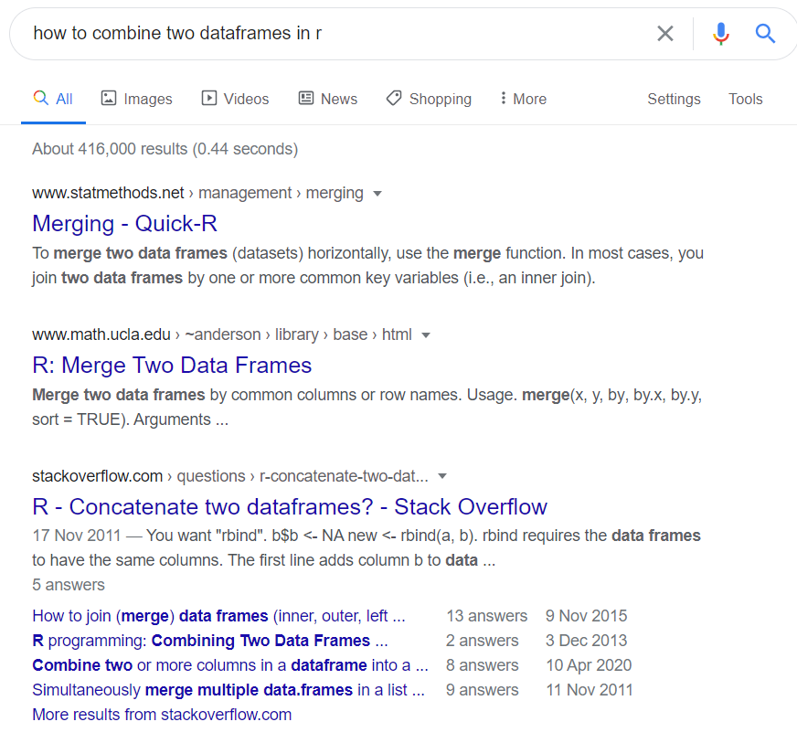
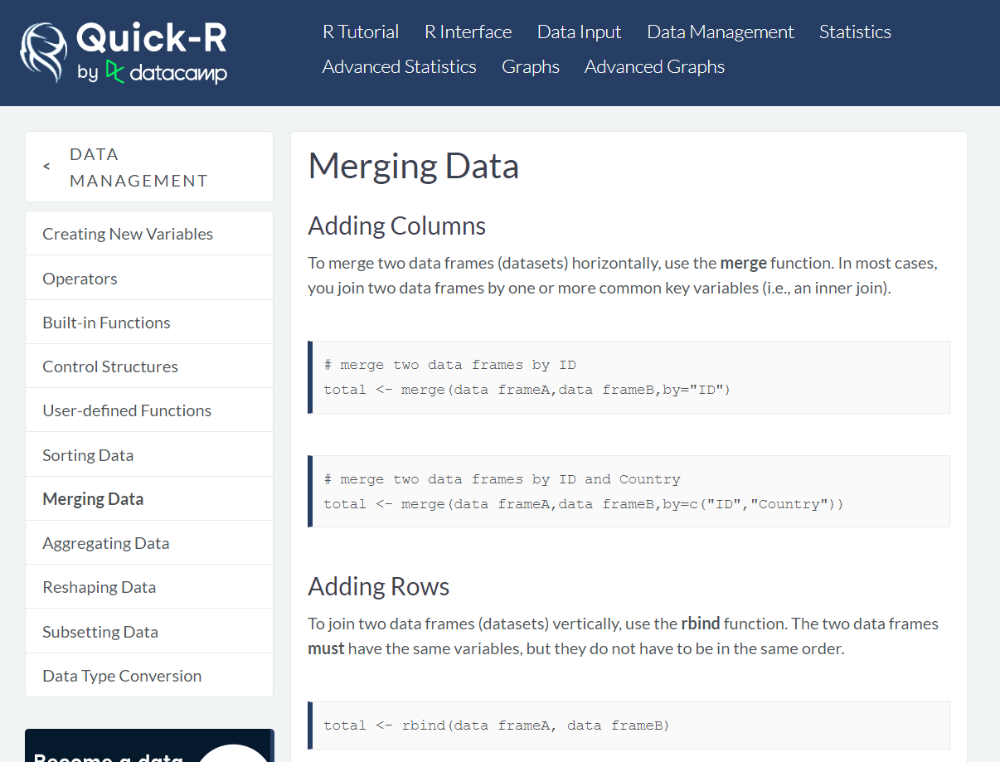
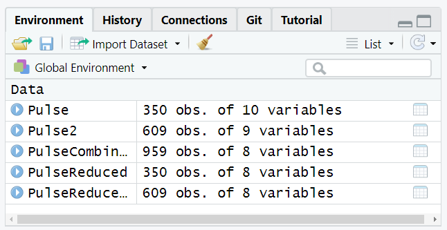
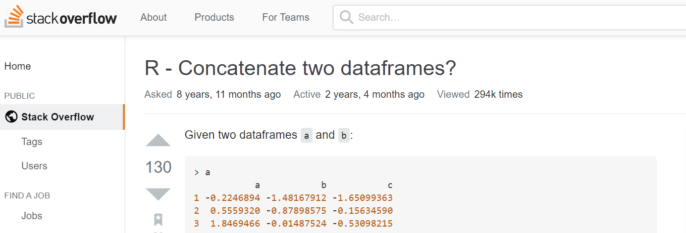
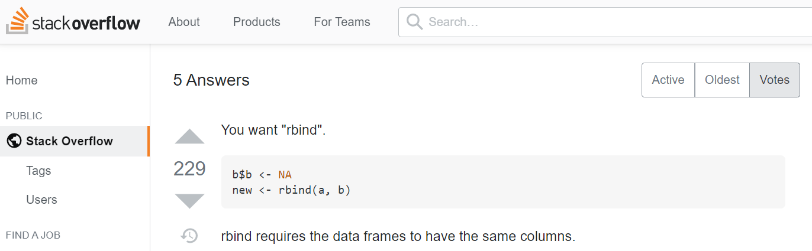
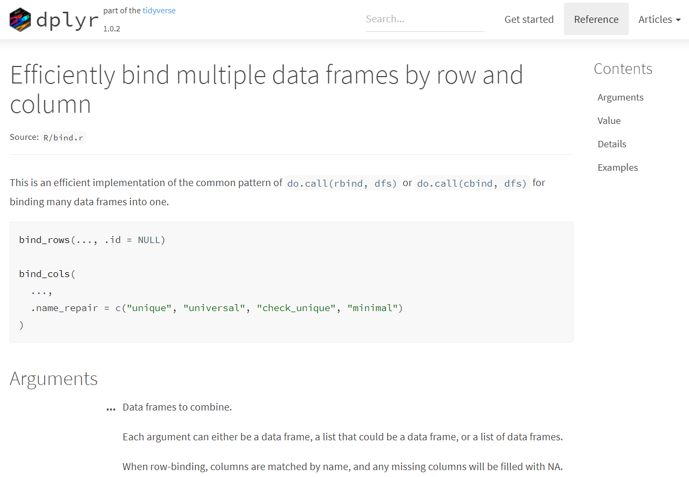
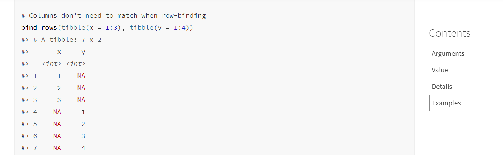
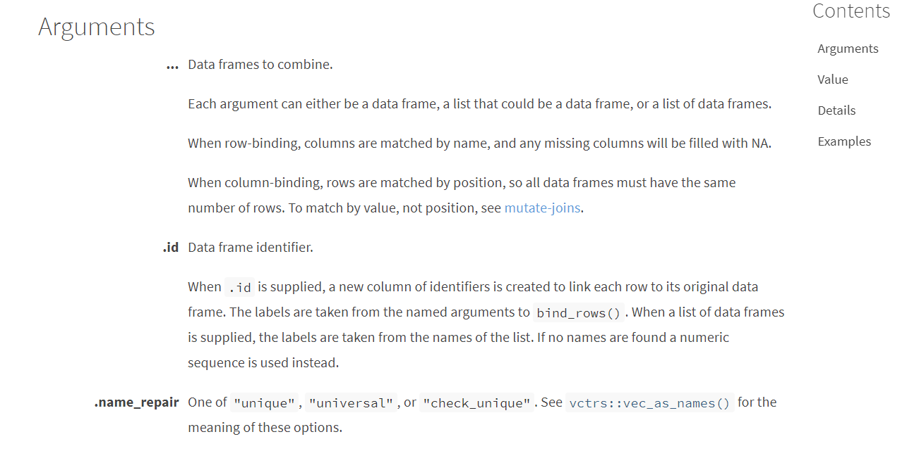
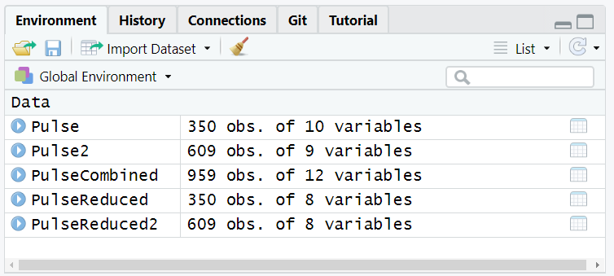
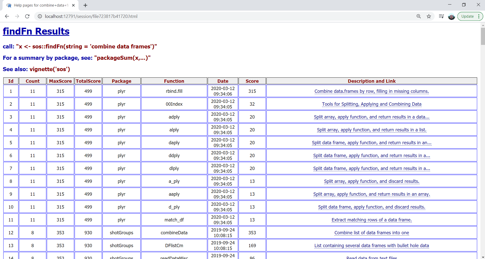

```{r setup, include=FALSE}
library(learnr)
library(tidyverse)
library(knitr)
library(janitor)
tutorial_options(exercise.timelimit = 10)
Pulse<-readRDS("Pulse.RDS")
Pulse2 <- readRDS("Pulse2.RDS")
```


## Overview

We are now reaching the end of this R course. If you've followed through all the workbooks and done all the exercises, you should be able to do a lot of things in R. And hopefully you start to feel at ease with this programming language and the RStudio interface.

That is not to say that the journey is over though. We've only covered a tiny fraction of all the things one can do with R! This fraction was aimed at preparing you for the rest of the journey. One where you continue learning on your own, by searching online for solutions, reading bits of documentations and finding where to ask for help. And you will do that a lot. Trust us. We're still doing that constantly. In this page, we'll explain you how we proceed, and show you a few additional R commands along the way.


## Finding solutions online

What is great with R is that it has a large community of very helpful people. So in general, for most problems related to R, it is possible to find a solution online. You can find solutions in many different places: Q&A sites, forums, blog posts, tutorials, package documentations, online books, cheatsheets, videos...

The simplest is usually to start with a search engine like <a href="https://www.google.co.uk/" target="_blank">Google</a>, or <a href="https://rseek.org/" target="_blank">Rseek</a>. For the former, since it is not R-specific, it is important to always add the letter `R` in your search.

What to write in the search box depends of the type of problem that you are facing, whether you have an error, or you can't find how to do something.


**If you have an error**

If your problem is that R gives you an error, the first thing you should do is try to understand what the error means, check things like spelling errors and brackets, and have a go at things you suspect might fix the issue. If it doesn't work, copy the error (don't copy names, paths or other things that seem specific to your computer though!), go to your search engine, and paste the error. Add quotes around it. Add 'R' in front if you're not on Rseek, and if you suspect the issue is related to a specific function, add the name of the function in your search. Click search!


But the hardest part in fixing errors is usually not the search. It is more to understand the answers, decide whether they are relevant or not for your specific case and choosing which of the solutions to try. The same error can sometimes come from very different reasons so it is a bit of a trial and error. Even though it is often tempting to quickly try out every solutions you can find, the best in the long run is to take your time, read more about the why of each promising answer and keep note of your findings. That will make you much better at solving future errors. If you struggle a lot at the beginning, it's probably because you are not yet used to the most common errors, in which case, <a href="https://ourcodingclub.github.io/tutorials/troubleshooting/" target="_blank">this tutorial</a> on how to avoid common mistakes in R might be helpful. 


**If you don't know how to do something in R**

If your problem is not an error, but simply something you want to do in R, but don't know how, go to your search engine and make your search skills shine! In the next section, I show you how I proceed:


## Example

As an example, I'd like to combine the pulse dataset that we have used a few times already with a similar dataset, but collected one month later, in July 2019. Both datasets contain mostly the same columns, but not the same individuals.
We've seen how we could use the `_join` functions to merge columns from different data frames, but here what I want is to combine rows instead of columns - ie: place one data frame below another. If I had no clue how to proceed, I would type in my search engine something like *how to combine two data frames in r*, or *r combining datasets*, etc. Note that I would generally not use any quotes, at least at first.

Here are the first results I got from Google for *how to combine two dataframes in r* (note that I wrote *dataframes* instead of *data frames*. I often do this mistake. But Google didn't mind):

```{r echo=FALSE, out.width="80%", fig.align='center'}

```


The first thing I notice - and you will as well with time - is that I know two of the websites. The <a href="https://www.statmethods.net/management/merging.html" target="_blank">first link</a> is from the **Quick-R** website, which usually gives simple short R commands for a number of basic tasks. If there is an answer for my request there, I will have it quickly. And the <a href="https://stackoverflow.com/questions/8169323/r-concatenate-two-dataframes" target="_blank">third link</a> is from **Stack Overflow**, which is a question/answer site that is not specific to R, but a lot of people ask R-related questions there. You usually have to dig in a bit more to find the commands you need, but if your problem is complex or niche, you're definitely more likely to find some answers there than on Quick-R. 

It turns out my question is pretty basic and if I click on the Quick-R link I get to the following page

```{r echo=FALSE, out.width="80%", fig.align='center'}

```

I can read towards the bottom of the page:

> To join two data frames (datasets) vertically, use the **rbind** function. The two data frames **must** have the same variables, but they do not have to be in the same order".

Sounds promising.


You'll notice that the information is minimal though. If I don't manage to adapt the provided command to my needs, I'll have to search elsewhere... but I now know that the function `rbind()` is a good candidate to solve my problem, so in addition to going back to my search result, I have a new option: typing the usual `?rbind` command in RStudio or search for something like "r rbind" in my search engine in order to find more documentation on this function. Anyway, let's have a first try. But wait, do I need to load a library first? There's no information about it on Quick-R. In general, if there's no mention of a library, that's because the function is a base-R function. A quick look at the R documentation (`?rbind`) would confirm that. And R will tell us something like 'could not find function "rbind"' if it was not the case, so we'll find out.

The command provided by Quick-R is:

```
total <- rbind(data frameA, data frameB)
```

My data frames are `Pulse` and `Pulse2`. And I'd like my final dataset to be called say, `PulseCombined`. So this should be my command:

```{r bind1, exercise =TRUE}
PulseCombined <- rbind(Pulse, Pulse2)
```

Argh, we get an error. Well we should get used to that because it will happen often. But we are not afraid of errors any more, right? Plus this one makes sense. Because Quick-R was pretty clear that: 

> The two data frames **must** have the same variables, but they do not have to be in the same order.

And if we check back our column names, we can see that they are not exactly the same. The columns `Income` and  `Attractiveness` are not in `Pulse2`, whereas `InformedClimateOpinion` is not in `Pulse`:

```{r bind2, exercise =TRUE}
colnames(Pulse)
colnames(Pulse2)
```


One solution is to get rid of these three columns using `select()`. We could indicate the names of the columns we want as usual, but it is a bit shorter to remove the ones we don't want using the minus sign:

```{r bind3, exercise =TRUE}
PulseReduced <- select(Pulse, -Income, -Attractiveness)
PulseReduced2 <- select(Pulse2, -InformedClimateOpinion)
```


Let's add our `rbind` command, as well as a little `slice` command to have a look at the five first rows:

```{r bind4, exercise =TRUE}
PulseReduced <- select(Pulse, -Income, -Attractiveness)
PulseReduced2 <- select(Pulse2, -InformedClimateOpinion)

PulseCombined <- rbind(PulseReduced, PulseReduced2)

PulseCombined %>% 
  slice(1:5)
```

Yay, there's no error! In RStudio, I would then check the Environment window:

```{r echo=FALSE, out.width="60%", fig.align='center'}

```

350 obs. + 609 obs. = 959 obs. and we still have 8 columns. Sounds good. This is only a quick check and you should also click on the little blue icon next to each dataset in your environment window, as well as producing a few summaries, but it will do for this session.


### Getting a better solution

I can tell you now that `rbind()` is not necessarily the function I would have chosen. It works well here, but there exists other functions that are more flexible, and so I'd tend to use these instead. It all depends on your needs. If you just need a quick one-time fix, just go for the first command that works for you. But if your think your problem is likely to come up regularly in various form, or you can sense that you will struggle to get what you really want, then, it may be worth spending a bit more time in your search, to find an equally good solution, but a solution that will save you time and effort in the long run.

In my case, I want to keep all my columns and I'd also like to have a column in my new data frame that keeps track of the origin of each row - ie: Pulse or Pulse2. I know with a bit of work I can achieve that with `rbind()`, but if I have a lot of different datasets to bind, it's going to be painful. And I'm sure you would realise that too after reading a bit more about `rbind()`.


So back to our search engine. If we click on the second link, we get the online version of the R documentation for the function `merge()`. The R documentation is rarely the best place to go to when we don't know what function we need to use. And for information, `merge()` is the base-R alternative to some of the `_join` functions, so it's not useful here. Now the third link gets us to the following question in Stack Overflow:

```{r echo=FALSE, out.width="100%", fig.align='center'}

```

And the most popular response is the same as what we got from Quick-R, only with some example matching the question. You'll often find examples on Stack Overflow:
```{r echo=FALSE, out.width="100%", fig.align='center'}

```


But did you look at the date? The question was asked nearly 9 years ago! That doesn't mean the answers are bad, but we can assume that there are new functions to do the task, some of which may be better. Going down the thread of responses, there are actually some nice relatively recent answers, but a good trick to get up to date solutions is to limit search to the past year or so in your search engine. In addition, the first search gave me some new keyword to consider. Maybe *bind* is a better word than *combine*:

```{r echo=FALSE, out.width="80%", fig.align='center'}
include_graphics("./images/GoogleSearch2.PNG")
```

Somehow I recognize again the first and third results. The first link brings us to the documentation of `dplyr`, where we see that the function `bind_rows()` might be a new good candidate. Especially as we are already familiar with `dplyr`.  


```{r echo=FALSE, out.width="100%", fig.align='center'}

```

The third link is from the RStudio Community, which has become an alternative to Stack Overflow in recent years. Anyway. I want to try the function `bind_rows`, because when I scroll down on the first link I can see in the examples that I can combine rows even if the columns don't match:

```{r echo=FALSE, out.width="100%", fig.align='center'}

```

Plus there is this .id argument that seems to do exactly what I want to keep track of the original data frames:

```{r echo=FALSE, out.width="100%", fig.align='center'}

```


The basic command seems to be very similar to rbind.
```
PulseCombined <- bind_rows(Pulse, Pulse2)

```

And it seems like the argument .id just requires we give a name to the column that will keep track of the original datasets. 'dataset' sounds like a good name. Let's try:

```{r bind5, exercise =TRUE}

PulseCombined <- bind_rows(Pulse, Pulse2, .id = "dataset")

PulseCombined %>%
  slice(1:5)

```

Checking the number of rows (959) and variables (12) in the environment window, I think it worked!


```{r echo=FALSE, out.width="60%", fig.align='center'}

```


Has one month changed something on the approval of Trump's presidency by people from the US?

```{r bind6, exercise =TRUE}

PulseCombined <- bind_rows(Pulse, Pulse2, .id = "dataset")

PulseCombined %>%
  tabyl(dataset, ApproveTrump) %>%
    adorn_percentages()%>%
      adorn_pct_formatting()
```

Not much.


### Find what works for you

The aim of this example was to give you an idea of how I proceed. But you should explore and see what works for you. Because there are lots of other ways you could proceed, some of which I am not aware of. For example, I just discovered this function called  `findFn()` from the `sos` package that searches the help pages of R packages. The syntax is simple. You just write keywords within the functions and surround the whole text by quotes. It then opens a webpage with the results. I typed the following command
```
findFn("combine data frames")
```

And I got this:

```{r echo=FALSE, out.width="100%", fig.align='center'}

```

A long list of functions, their respective packages, a brief description with a link to the help documentation, and you can sort the results by various scores. You can learn more about the package `sos` from its vignette <a href="https://cran.r-project.org/web/packages/sos/vignettes/sos.pdf" target="_blank">here</a>.


Oh yeah, I didn't talk about vignettes. As we've seen, every decent package comes with at least a basic documentation of its functions that you can then access via `?`. But it is not very friendly and not useful at all if you don't know the function you want to use.  Developers are also encouraged to write long-form friendly guides called 'vignettes' that often take the form of a tutorial or article going over the most important capabilities of the package. When they exist - and they usually do for good packages - I find vignettes to be the best way to get a good idea of what a package has to offer. Typing "r vignette name-of-the-package" in your search engine will usually get you to its vignette(s). Otherwise, if you have the package installed on your computer, you can type this command:

```
vignette("name-of-the-package")
```


## Asking for Help

You should always start by looking for solutions on your own. It's how you learn the most. But at some point, if you can't solve your problem, you should probably consider the next step: asking for help.

There are a few places where you can ask for help.


**R-help**

The more or less *official* place to ask for help is the R-help mailing list. You send your question to `r-help@r-project.org` and some people from the R community will likely respond to you within a day or two, and sometimes just a couple of hours, depending on the question. You should subscribe to the mailing list <a href="https://stat.ethz.ch/mailman/listinfo/r-help" target="_blank">here</a> though. Otherwise you'll have to wait the approval of moderators.

Also very important, read the <a href="https://www.r-project.org/posting-guide.html" target="_blank">posting guide page</a>! It may feel like too much effort for a simple question, but it's an investment for the future. You're building an expertise on how to ask questions that have good chances to receive useful answers. This will save you tons of time in the long run. Plus it helps the community of helpers as well as all the people who will have similar problems and will be able to find a solution thanks to your nicely framed question. You'll make a ton of people grateful if you follow the guidelines!


**Stack Overflow**

Stack Overflow is one of the best places to ask questions as proved by the number of times you'll end up on the site when you search for solutions. It is not a platform specific to R though, so make sure you tag your question as `R`. If you plan to post your question there, read carefully their <a href="https://stackoverflow.com/help/how-to-ask" target="_blank">How to ask a good question</a> page, to increase your chance of getting good responses and help the people who will try to answer your question. And while we're there, have a look at their R tag's <a href="https://stackoverflow.com/tags/r/info" target="_blank">about page</a> which contains a lot of links to useful resources related to R.

Also note that if you have questions related to Statistics or Data Science, you can ask these at their sister site <a href="https://stats.stackexchange.com" target="_blank">Cross Validated</a>!


**RStudio Community**

In recent years, the RStudio community <a href="https://community.rstudio.com" target="_blank">discussion board</a> has become another popular place to ask questions about R. If your problem is directly related to RStudio or any of the tidyverse packages, that's probably the best place to ask your question. Like for the other platforms, you should read and follow the guidelines of the <a href="https://community.rstudio.com/t/welcome-to-the-rstudio-community/" target="_blank">Welcome page</a> before posting.


**People around you**

What is nice with posting questions online is that you're helping the R community. But if somehow the above doesn't work for you, you can always ask around you. R is quite popular now, so surely some colleagues, friends or teachers at the University should be able to help. And the other students who are taking part of this course may also be happy to help. If you don't manage to get help with all of that, it's probably that you're not asking your question well. Go back to the R-help or Stack Overflow guides on posting questions and try again!


## Appendix: The datasets

In this session, we are using two datasets that were constructed from the Pulse of the Nation series of surveys. These surveys were conducted in the US between September 2017 and August 2018 and were all representative samples of the American population. You can read more about the Pulse of the Nation series of survey <a href="https://thepulseofthenation.com" target="_blank">here</a>.

The data used in this course have been cleaned and edited slightly.


**'Pulse' dataset**
The first dataset is the usual 'Pulse' dataset that we have used a few times now. It comes from the Pulse of the Nation survey conducted in June 2018. It contains an extract of 356 responses to 10 of the survey questions.

A summary of the columns is given below.

```{r, echo=FALSE,message=FALSE,warning=FALSE}


data.frame(Column=c("Gender","Age","AgeGrp","Race","Income","Education","PoliticalParty","PoliticalView","ApproveTrump","Attractiveness"),
           Description=c("What gender do you identify with?","What is your age?","Age range","What is your race?",
                         "About how much money do you make per year? (USD)","What is your highest level of education?",
                         "In politics today, do you consider yourself a Democrat, a Republican, or Independent?",
                         "Would you say you are liberal, conservative, or moderate?",
                         "Do you approve, disapprove, or neither approve nor disapprove of how Donald Trump is handling his job as president?",
                        "On a scale of 1-10, how physically attractive do you consider yourself?")) %>% kable()

```


**'Pulse2' dataset**
The second dataset is an extract of the Pulse of the Nation survey conducted one month later, in July 2018. It contains 609 responses to 9 of the survey questions, and has been imported to R as a data frame called `Pulse2`.

A summary of the columns in the dataset given is below.

```{r, echo=FALSE,message=FALSE,warning=FALSE}


data.frame(Column=c("Gender","Age","AgeGrp","PoliticalParty","PoliticalView","Education","Race","ApproveTrump","InformedClimateOpinion"),
           Description=c("What gender do you identify with?","What is your age?","Age range",
                         "In politics today, do you consider yourself a Democrat, a Republican, or Independent?",
                         "Would you say you are liberal, conservative, or moderate?",
                         "What is your highest level of education?",
                         "What is your race?",
                         "Do you approve, disapprove, or neither approve nor disapprove of how Donald Trump is handling his job as president?",
                        "Would you say that your opinions on climate change policy are well-informed, or not very well-informed?")) %>% kable()

```


## Appendix: Useful reference links


Google: <a href="https://www.google.co.uk/" target="_blank">https://www.google.co.uk/</a>

Rseek: <a href="https://rseek.org/" target="_blank">https://rseek.org/</a>

How to avoid common mistakes in R - Coding Club<a href="https://ourcodingclub.github.io/tutorials/troubleshooting/" target="_blank">https://ourcodingclub.github.io/tutorials/troubleshooting/</a>

R-help mailing list: <a href="https://stat.ethz.ch/mailman/listinfo/r-help" target="_blank">https://stat.ethz.ch/mailman/listinfo/r-help</a>

Stack Overflow's R tag about page: <a href="https://stackoverflow.com/tags/r/info" target="_blank">https://stackoverflow.com/tags/r/info</a>

Cross Validated: <a href="https://stats.stackexchange.com" target="_blank">https://stats.stackexchange.com</a>

RStudio community discussion board: <a href="https://community.rstudio.com" target="_blank">https://community.rstudio.com</a>

Help for R website: <a href="http://search.r-project.org" target="_blank">http://search.r-project.org</a>

How to ask a good question - Stack Overflow: <a href="https://stackoverflow.com/help/how-to-ask" target="_blank">https://stackoverflow.com/help/how-to-ask</a>